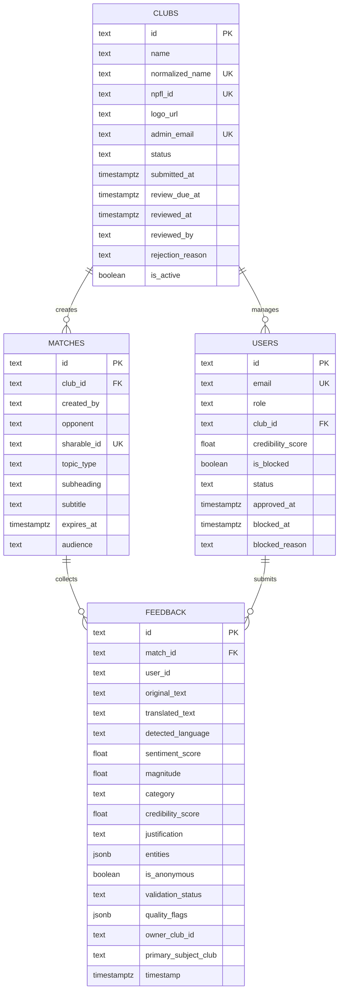
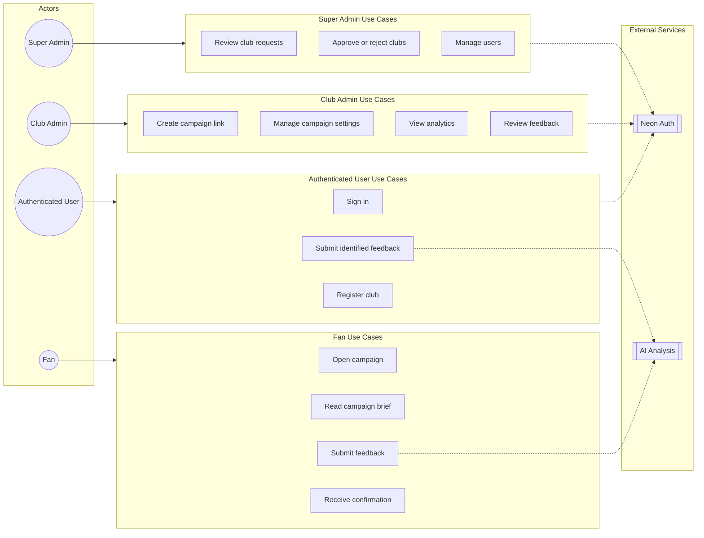

# Feedback Analyzer System Diagrams

This document captures the main data model and user flows for the Feedback Analyzer project.

## Entity Relationship Diagram

The database has four core entities. Clubs own campaigns, campaigns receive feedback, and users can manage clubs or submit authenticated feedback.

## Activity Diagram

The activity flow is split into the three main user paths: fan feedback, admin campaign creation, and super admin review.

```mermaid
flowchart TD
  subgraph FanFlow["Fan Feedback Flow"]
    F1([Open campaign link])
    F2[View campaign brief]
    F3[Enter feedback]
    F4[Submit feedback]
    F5{Valid feedback?}
    F6[Analyze sentiment and credibility]
    F7[Save feedback]
    F8([Show confirmation])
    F9([Show error])

    F1 --> F2 --> F3 --> F4 --> F5
    F5 -->|Yes| F6 --> F7 --> F8
    F5 -->|No| F9
  end

  subgraph AdminFlow["Club Admin Flow"]
    A1([Sign in])
    A2[Open admin dashboard]
    A3[Create campaign link]
    A4[Set subject, subtitle, audience, expiry]
    A5[Share generated link]
    A6[View insights]

    A1 --> A2 --> A3 --> A4 --> A5
    A2 --> A6
  end

  subgraph SuperAdminFlow["Super Admin Flow"]
    S1([Sign in])
    S2[Review club request]
    S3{Decision}
    S4[Approve club]
    S5[Reject club]

    S1 --> S2 --> S3
    S3 -->|Approve| S4
    S3 -->|Reject| S5
  end
```

## Use Case Diagram

The use case diagram groups actions by actor and keeps shared services separate.

